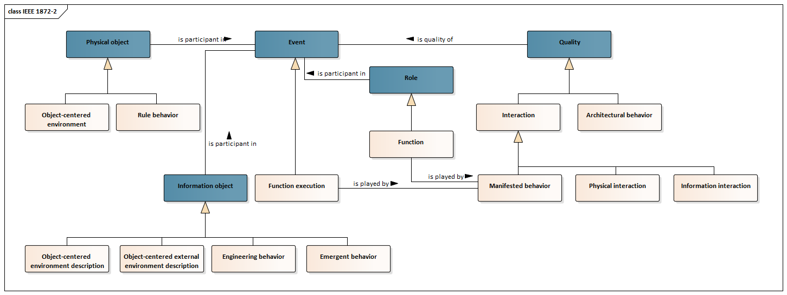

# IEEE Standard for Autonomous Robotics (AuR) Ontology

## Introduction

The development of software functionalities, or applications in general, that monitor and analyze robot-related data in order to improve, support or automate processes, is becoming increasingly important in industry. These applications require several information from different data sources in their context. An application that is planning a maintenance workers daily schedule for instance, requires several information about robot statuses, mission plans and other object states, which resides in different systems likes Companion Computers or Structured Query Language (SQL) databases. Furthermore, companies usually run robots and software systems from different vendors or of different ages. The schemata used in such systems do therefore not follow a certain standard, i.e. they are very heterogeneous in their semantics. When building such applications, accessing, searching and understanding the data sources is becoming a very time intensive, manual and error prone procedure that is repeated for every newly build application and for every newly introduced data source. To allow for an eased access, searching and understanding of these heterogeneous data sources, an ontology can be used to integrate all heterogeneous data sources in one schemata. 


This repository contains an ontology of IEEE Standard 1872.2 which is a standard to describe domain-speficic concepts and definitions used in Autonomous Robotics. We maintain a whole list of standard-based ontologies, check out these links:
 - [DIN EN 61360](https://github.com/hsu-aut/IndustrialStandard-ODP-DINEN61360)
 - [VDI 2206](https://github.com/hsu-aut/IndustrialStandard-ODP-VDI2206)
 - [VDI 2860](https://github.com/hsu-aut/IndustrialStandard-ODP-VDI2860)
 - [DIN 8580](https://github.com/hsu-aut/IndustrialStandard-ODP-DIN8580)
 - [ISA 88](https://github.com/hsu-aut/IndustrialStandard-ODP-ISA88)
 - [WADL](https://github.com/hsu-aut/IndustrialStandard-ODP-WADL)
 - [DIN EN 62264-2](https://github.com/hsu-aut/IndustrialStandard-ODP-DINEN62264-2)
 - [OPC UA](https://github.com/hsu-aut/IndustrialStandard-ODP-OPC-UA)
 - [ISO 22400-2](https://github.com/hsu-aut/IndustrialStandard-ODP-ISO22400-2)
 - [VDI 5100](https://github.com/hsu-aut/IndustrialStandard-ODP-VDI5100)


## IEEE 1872.2 - Autonomous Robotics (AuR) Ontology

The ontology of the IEEE 1872.2 standard describes domain-specific concepts of autonomous robots [1]. This is intended to provide a foundation for further descriptions of autonomous robots and can be extended to include more specific concepts for a particular application, for example. This domain ontology enables comparability of autonomous robots.  
The ontology extends the IEEE 1872 standard that defines important terms in robotics and automation [2]. Additionally, the two upper ontologies DUL and SUMO are used. Figure 1 shows the information model of the ODP in the form of a UML class diagram. Only the upper ontology DUL is shown, which is also integrated in the available ontology. Since the SUMO ontology does not have an owl representation, it is excluded in the ontology and in the mapping for now. Similar to IEEE 1872, the corresponding concepts and relationships can be created in another ontology but have no relation to the original SUMO ontology. <br>
The classes with blue background are classes from the upper ontology DUL. The other classes are from the standard presented here. This ontology can be used to describe functions and function executions. A function is provided by a robot, which is actually executable via function execution. Likewise, interactions between autonomous robots or even other objects can now be described. In the same way, the environment can be specified. A detailed description can be found in the standard [1]. 


Figure 1: Autonomous Robots according to IEEE 1872.2      

[1] IEEE 1872.2-2021. IEEE Standard for Autonomous Robotics (AuR) Ontology, 12.05.2022. <br>
[2] IEEE 1872-2015. IEEE Standard Ontologies for Robotics and Automation, 10.04.2015.

## Usage

If you want to use this ontology design pattern, the easiest way is to directly import it into your ontology via `owl:imports` statements. Make sure to reference a fixed release version so that you can't get surprised by future changes. For this example it would be http://www.w3id.org/hsu-aut/ieee1872.2/1.0.0. You can use this URL in an `owl:imports` statement of your ontology. If you're having trouble using this URL in a tool like Protégé, try opening your ontology with a text editor and simply inserting your imports manually.
An example of an imports section looks like this:

```xml
<owl:Ontology rdf:about="http://www.hsu-ifa.de/ontologies/capability-model#">
    <owl:versionIRI rdf:resource="http://www.hsu-ifa.de/ontologies/capability-model/1.0.0#"/>
    <owl:imports rdf:resource="http://www.w3id.org/hsu-aut/ieee1872.2/1.0.0"/>
</owl:Ontology>
```
Of course you can also clone or download this repository and import an ODP from a local copy. The advantage of the first approach is that tools like Protégé or TopBraid Composer will directly use the ontologies from the internet and you can simply increase the version number in case you want to use a newer version of our ODPs.
